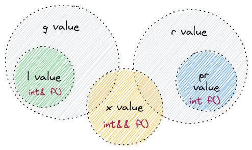
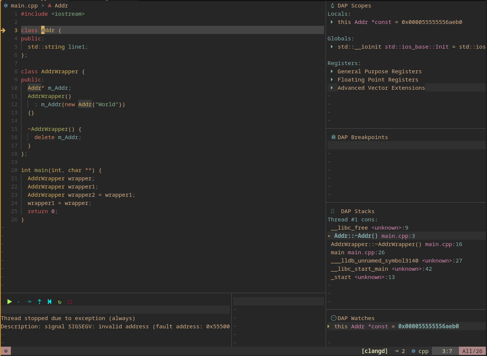

# mess.cpp - N specific things that will brighten up your life

Welcome to mess.cpp - the file that describes some weird moments and caveats about C++. Some of them can lead to a disaster.
Some of them will make you smile. But as you will notice at the end of this page, my main goal here
is to raise a discussion about improving ecosystems instead of arguing about language features.
Even if you skip most of the sections below, please read the [Plea](#plea).

> inspired by [$stdout - Mess.css](https://www.youtube.com/watch?v=0yXJ4t6Ax1U)

## Type inference to the rescue!

Look at the following code:

```cpp
std::unordered_map<std::string, int> map;

for (const std::pair<std::string, int>& p : m)
{
  // use the reference somehow
}
```

Easy, right? We iterate over a map and log the number. We also use a const reference to each element to prevent unnecessary copying.

:::caution Problem

The code above copies `std::pair` on each iteration. 

:::

**Why?** To explore the answer yourself - go to [cppreference](https://en.cppreference.com/w/cpp/container/unordered_map) or
[gcc/unordred_map.h](https://github.com/gcc-mirror/gcc/blob/bad177e848787258070415dbe002b2c6fba1c511/libstdc%2B%2B-v3/include/bits/unordered_map.h)
and look for `std::unordered_map::value_type`.

<details>
  <summary>Answer</summary>

```cpp title=gcc/unordered_map.h
/*
* The resulting value type of the container is std::pair<const _Key, _Tp>.
*/
template<typename _Key, typename _Tp,
// ...
typename _Alloc = allocator<std::pair<const _Key, _Tp>>>
class unordered_map
```

Have you noticed the `const` qualifier?

It means that `std::unordered_map<std::string, int>::value_type` is actually `std::pair<const std::string, int>`.

We "iterate" over the `value_type` values, but the compiler sees that we want `const std::pair<std::string, int>&` instead.

What can a compiler do in this case?
It somehow needs to convert `std::pair<const std::string, int>` to `std::pair<std::string, int>`, const the `std::pair` and give us a reference.

How to convert something const to something mutable? Yep, **copy!** the left pair, create a temporary one, AND because we asked for a reference,
the compiler will actually give us a reference to the temporary object.

</details>

To make sure you understood it, what's wrong with the following code?

```cpp
std::unordered_map<std::string, int> map;
map["hey"] = 24;

const int* dPtr = nullptr;

for (const std::pair<std::string, int>& e : map)
{
    dPtr = &e.second;
}

map.find("hey")->second = 22;

// what is the output here?
std::cout << *dPtr;
```
  
1. This code has undefined behavior. `dPtr` points to memory that could be invalid after each iteration.
2. In case the memory allocated for a temporary object is still untouched, `cout` will print `24`.
3. This code will **never** print `22`.
4. To make `cout` print `22` we need to:
    - add const qualifier: `for (const std::pair<const std::string, int>& e : map)`
    - use type inference: `for (const auto& e : map)` (preferred way)

**Lesson**: don't ignore compiler warnings and use `auto` when applicable.

Speaking of `auto`, let's explore quirks of type inference in C++.

## Type inference to the bone

`auto` is an easy concept.

Let's look at this simple, tiny example. This is child's play.

```cpp
std::vector<bool> v = {false};

const bool a = v[0];
const auto b = v[0];
const auto& c = v[0];

std::cout << a << b << c << " ";

v[0] = true;

std::cout << a << b << c;
```

What will be the output of this code? `000 001` because only `c` is a reference? or `000 000` because all of them are const? More guesses?

<details>
  <summary>Answer</summary>

  This code will output `000 011`.

</details>

Why? Because [`std::vector<bool>`](https://en.cppreference.com/w/cpp/container/vector_bool) is a specialization of `std::vector` that aims to improve space efficiency. While most `vector<T>::operator[]` return a reference `T&`, it's not the case with `vector<bool>::operator[]`. This one returns a special kind of reference defined in [`vector<bool>::reference`](https://en.cppreference.com/w/cpp/container/vector_bool/reference)

So, let's describe each variable we have:

`const bool a` is initialized by converting reference to a boolean using `std::vector<bool>::reference::operator bool()`. Memory is not modified after initialization.

`const auto b` type is deduced to `std::vector<bool>::reference` and initialized using another `reference` returned from `operator[]`. This reference "points" to memory with a special representation of our vector.
Hence, changing the value we store in that memory *does not change the reference itself*, but because reference acts as a "proxy class", we can see the changes in the second cout statement.

And finally, `const auto& c`. The "auto" part is deduced the same way, but we get a C++ reference (&) to a temporary `std::vector<bool>::reference` instance.

<details>
  <summary>Ouch, is that Undefined Behavior?</summary>

No. `const auto&` is a const lvalue reference. Such references (and rvalue references) extend the lifetime of temporaries.

So, that temporary `std::vector<bool>::reference` lives until `const auto& c` is alive.
- Using `const auto&& c` would work the same way.
- Using `auto&& c` would work the same way.
- Using `auto& c` would not compile because we'd try to bind rvalue ref to lvalue ref and the special rule for const lvalue doesn't work here.

</details>

I used the word "initialized" in this section, let's explore something new about it!

## UIIAM - Uniform Initialization is a Mess

Let's skip the fact that we have both `()` and `{}` for initialization. It's OK, we need backward compatibility.

The **Uniform Initialization** is the one that might lead to a disaster.

Look at the following code and try to analyze what the stdout output will look like if we run it.

```cpp
class Printer {
public:
  Printer(int, bool) { std::cout << "(int,bool)"; };
  Printer(int, float) { std::cout << "(int,float)"; };
  Printer(int, std::string) { std::cout << "(int,string)"; };
};

Printer(1, false); // (int,bool)
Printer(1, 0.12f); // (int,float)
Printer(1, std::string("str")); // (int,string)

// Now let's look at the ones using Uniform Initialization - {}:
Printer{1, false}; // (int,bool)
Printer{1, 0.12f}; // (int,float)
Printer{1, std::string("str")}; // (int,string)
```

Easy peasy, right? shout-out to lemonsqueezy, btw.

But what if later someone adds another ctor to the Printer class?

```cpp
class Printer 
{
public:
  Printer(int, bool) { std::cout << "(int,bool)"; };
  Printer(int, float) { std::cout << "(int,float)"; };
  Printer(int, std::string) { std::cout << "(int,string)"; };
  // A Note by developers of this ctor:
  // Used to setup printer using a list with variable size...
  //
  // Example: Printer({0.5, 123.9, ...})
  //
  Printer(std::initializer_list<double>) {
    std::cout << "(ui_list)";
  };
};

// () ones are not affected, let's forget about them

// What about the ones with Unified Initialization?

Printer{1, false}; // ?
Printer{1, 0.12f}; // ?
Printer{1, std::string("str")}; // ?
```

🙈 Can you spot the evil?

<details>
  <summary>Answer</summary>

Well, there are 2 of them.

```cpp
Printer{1, false}; // (ui_list)
Printer{1, 0.12f}; // (ui_list)
Printer{1, std::string("str")}; // (int,string)
```

- `{1, false}` is initializer list -> now it uses the new ctor.
- `{1, 0.12f}` is initializer list -> now it uses the new ctor.
- `{1, std::string("str")}` is initializer list, **but** `std::string` is not convertible to `double`, hence the old ctor is used.

</details>

The worst part of this story is that developers who added the `initializer_list` constructor didn't get any warnings while writing this code.
The only hope they can have is that unit tests will catch such a mishap.

## Changelog: `call()` method now does X instead of Y for rvalues... Wait wat?!

This one is good... Until someone needs to make changes without having access to the client code.

```cpp
class Base {
public:
  virtual std::string call() & { return "Base &"; }
  virtual std::string call() && { return "Base &&"; }
  virtual ~Base(){}
};

class Derived : public Base {
public:
  std::string call() && override { return "Derived &&"; }
};

std::unique_ptr<Base> ij = std::make_unique<Derived>();

std::cout << Derived().call() << "\n"
  << std::move(*ij).call() << "\n"
  << ij->call() << "\n"
  << Base().call();

// Outputs the following:
//
// Derived &&
// Derived &&
// Base &
// Base &&
```

- `Derived()` is rvalue
- `std::move` casts lvalue to rvalue
- `*ij` is lvalue - `Base&`
- `Base()` is rvalue

Now imagine someone has to add the following to the `Derived` class:

```cpp
std::string call() & override { return "Derived &"; }

// Output will be the following:
// Derived &&
// Derived &&
// Derived & - *ij is lvalue, but now the method is overriden in Derived class
// Base &&
```

Good luck finding every single place in a codebase where the behavior is changed. Especially when you have the opposite situation - adding an "rvalue method" override.

## Value categories? xyuvalue!

One day a friend of mine was interviewed at company X, and the interviewer asked him what value categories is he aware of.
`lvalue` & `rvalue` were the only ones my friend could remember, so he described them.
But the interviewer pushed through and asked if he could remember & describe other ones.

My friend's feelings at that moment can be described with this [X.Y.U. song by The Smashing Pumpkins](https://youtu.be/Htz_U7073i0?t=256) - particularly the part from `4:15` to `5:00`. I'm not used to such music, it's kinda hard to understand words. Here are the [lyrics](https://genius.com/The-smashing-pumpkins-xyu-lyrics), just in case.

Back to C++. Go read https://en.cppreference.com/w/cpp/language/value_category, https://www.stroustrup.com/terminology.pdf, https://stackoverflow.com/a/3601661, and https://learn.microsoft.com/en-us/cpp/cpp/lvalues-and-rvalues-visual-cpp.

Now, keeping a straight face, try to tell me it's not a mess. Imagine handing it all over to a newcomer.

Here are some helpful associations I've built for myself:



- **lvalue**: variables, value name, value binding, storage, has identity - `int& f()`
- **prvalue**: pure results from expressions, literals except strings, no identity - `int f()`
- **xvalue**: expiring values, has identity - `int&& f()`
- **glvalue**: has identity - `int& f()` or `int&& f()`
- **rvalue**: might have identity - `int&& f()` or `int f()`

```cpp
void consume(int&& param) {
  // !! param is lvalue !!
  // but the argument to this function is rvalue
};

consume(1); // fine, 1 is prvalue (rvalue without identity)

int lvalueArg = 1;
consume(lvalueArg); // error: fun expects rvalue argument!
consume(std::move(lvalueArg)); // fine, std::move(lvalueArg) is xvalue (rvalue with identity)
```

## const methods can modify mutable members

A classic example:

```cpp
class Model {
public:
  // ...

  int compute() const {
    if (!m_HasCachedResult) {
      // perform very expensive computation
      m_CachedResult = somelib::compute(...);
      m_HasCachedResult = true;

      // m_HasSomethingElse = true; // error
    }

    return m_CachedResult;
  }
private:
  mutable int m_CachedResult;
  mutable bool m_HasCachedResult{false};

  bool m_HasSomethingElse{false};
}
```

`mutable` does look like a dirty workaround, but it's not the biggest problem here.
The problem is this code sometimes leads to wrong assumptions.

It turns out some people expect const methods to be thread-safe "because they don't modify anything".
This assumption is wrong and would still be wrong even if `mutable` didn't exist - because `const` methods can access memory
that is being written by another thread atm.

So, the "functions are thread-safe if **memory** they touch can not be modified in general" seems to be a better assumption. Note how I dumped the "const method", this is true for any method/function, const or non-const.

Speaking of the example, we need to synchronize the `compute()` method ONLY when we need to - when it can be used concurrently.

## const move = copy

Let's go back to where we started

```cpp

class SHolder {
public:
  SHolder(const std::string str1, std::string str2)
    : m_Str1(std::move(str1))
    , m_Str2(std::move(str2))
  {
    std::cout << str1 << "\n" << m_Str1 << "\n";
    std::cout << str2 << "\n" << m_Str2 << "\n";
  }

  std::string m_Str1;
  std::string m_Str2;
};

SHolder holder("ITS-CONST STR", "NON-CONST STR");
```

Any ideas about the stdout of this code?


<details>
  <summary>Answer</summary>

  ```
  ITS-CONST STR
  ITS-CONST STR

  NON-CONST STR
  ```

  As we call the ctor, two strings are constructed. `std::move` casts to rvalue.

  `str2` is non-const, hence `std::string` move ctor is called with `std::string&&`.

  `str1` is const -> move ctor is called with `const std::string&&`.

  How to convert something const to something mutable (`m_Str1` is mutable)? Yep, the same story, **copy!**
</details>

## The rule of three/five/zero/1/2/4/6?!

This one is the cherry on the cake. It's a beloved one among C++ opponents.

```cpp
class Addr {
public:
  std::string line1;
};

class AddrWrapper {
public:
  Addr* m_Addr;
  AddrWrapper()
    : m_Addr(new Addr{"World"})
  {}

  ~AddrWrapper() {
    delete m_Addr;
  }
};

AddrWrapper wrapper;
AddrWrapper wrapper1;
AddrWrapper wrapper2 = wrapper1;
wrapper1 = wrapper;
```

Even the fact that this code compiles is problematic.
Yes, we can use unique_ptr in this scenario. Yes, we can create custom deleters for it.
Yes, we can utilize something like boost::noncopyable. But there are "rare" cases when those are not possible and they are exactly the reasons for having [these rules](https://en.cppreference.com/w/cpp/language/rule_of_three).

**Note**: if it's not obvious to you, please try to understand it by googling share your experience about succeeding/failing this task somewhere - in the comments, on twitter, etc. Was it easy to find a good explanation?



## EaaS - Ecosystem as a Mess

People reading this post might think "Those cases are not that bad".
At the end of the day, some of the things described here become irrelevant.
As your codebase grows, you tend to build safe abstractions around tricky stuff to prevent unexpected behaviors.
Tools you use evolve. Besides that, most people get used to all the pitfalls specific to your codebase/project/domain.

And the goal is not to know a solution to every single pitfall of your tool.

The goal is to develop an intuition that will help you to identify places where pitfalls could arise and work your way from there.
This intuition is domain-specific and may even lead to another tool due to the circumstances you are in.

Imagine you're holding a hammer and you want to use it. You aim to smash a huge glass sheet. You've got a lot of options:
- just go for it
- use reasonable protection (e.g. wearing safety glasses)
- use fully-fledged protection (e.g. wearing safety gloves and boots, getting insurance, or even having an ambulance right next to you)
- use a different tool
- give up the idea of smashing that sheet of glass

Your choices depend on your intuition and your domain knowledge.

People who love Haskell don't usually use it to implement a web UI for an e-commerce platform because it'd be a poor investment.
This doesn't make Haskell bad.

It's not the hammer's fault if someone uses it without protection. The hammer itself is not guilty here.
The hammer doesn't restrict you from ignoring, avoiding, reducing, or accepting the risk.
It tries to improve while being flexible, sometimes to the point where it's hard to grasp all the possible ways to use it.

**C++ feels messy because the ecosystem around it is a mess.**

The problems accumulated over the years are:
1. lack of "approachability" and up-to-date documentation about a clean, easily understandable subset of capabilities and clear instructions on using them efficiently in different domains
2. lack of convenient tooling around it: build systems, package managers, linters, etc. are painful
3. fragmented community, which leads to different compilers, implementations, standards, opinions on ABI, etc. This one is a curse. I'm not sure it's even possible to battle this curse
4. legacy systems
5. much more...

C++ tries to find a balance in all of this. Everything in this language has a reason behind it. Language designers are aware of those problems and they try to move forward, but they have to take into account a wide range of requirements they have.

**Instead of arguing about languages and their features, we could:**
1. thank all the people working on languages like C++, Rust, Javascript, or even Java
2. provide meaningful, constructive feedback to them
3. discuss ways to improve the ecosystems around them for specific domains ([xmake](https://github.com/xmake-io/xmake) is a good example of such efforts)
4. *(for c++)* re-engineer the community around the idea that newcomers are the priority

I feel like this shift would benefit the entire industry.

## Plea

**I appeal to the developers who still have warm feelings for C++ (even if you left the field):**

*Please, raise discussions about improving something around the language.* You might've worked in Elixir / Rust / Node / whatever ecosystem. Maybe you saw a great book, tool, approach, or something else that can be transferred to the C++ ecosystem.

Stop worrying about syntax and start raising questions like:
- Why don't we have an easy introduction book like Rust has? Can we make one? Can I make it?
- Can we try to learn from Rust and build a community by becoming attractive to people from other domains? What are those domains?
- Can we make implementing CLI applications convenient? Are there people who would like to develop convenient tools/libraries for this task? Why does nobody want to do it?
- Elixir used Erlang to accelerate itself but it also helped accelerate the Erlang ecosystem. Is it possible for us to do something similar?
- Why don't we have NPM packages in C++? Can we come up with a better alternative?
- How can we improve tools for programming games with C++? Is it possible for us to overcome issues [Jai](https://inductive.no/jai/) tries to solve without leaving C++ behind?
- Do we even need to pursue thing "X" or is it better to make a clear statement that C++ is not suited for domain X? How do we communicate this information to the newcomers and existing developers?
- When we do a conference, do we mention the tools our community built? Do we help them succeed?
- Should we have some kind of accessibility/approachability committee?
- Why everything around C++ feels so old? Why our learning resources are so ugly?
- etc.etc.etc.


Here we go, I raise a relatively simple question myself:
- When I type "learn C++" in google, why do I get results from w3schools, codecademy, and learncpp.com, but not from an official website that helps me choose the best learning resource specifically for me?
  - > Do you think it would be OK to approach the committee and ask if I can create an official "entry portal" for C++? Do we need this? Should I approach them with a different idea?

Thank you for your time, hopefully, I managed to make your eyes sparkle a bit.

##  One more thing

Where do I put my `std::enable_if`? 😊

## P.S.

Most examples are taken from the [Effective Modern C++](https://www.amazon.com/Effective-Modern-Specific-Ways-Improve/dp/1491903996) book.

Some images are made using [excalidraw](https://excalidraw.com/).

<iframe style={{width: '100%', 'aspect-ratio': '16 / 9'}} src="https://www.youtube.com/embed/aVQEbD3NyDw" title="YouTube video player" frameborder="0" allow="accelerometer; autoplay; clipboard-write; encrypted-media; gyroscope; picture-in-picture; web-share" allowfullscreen></iframe>

## About enable_if

```cpp
template <typename T, std::enable_if_t<std::is_integral_v<T>, void*> = nullptr>
```

Ah, I should use concepts, right?

Okay, so where do I put my `std::integral` then?

Now imagine how you would explain this to a newcomer who wants to add a cool feature to your product yet he/she never wrote a line of SFINAE C++ code.
